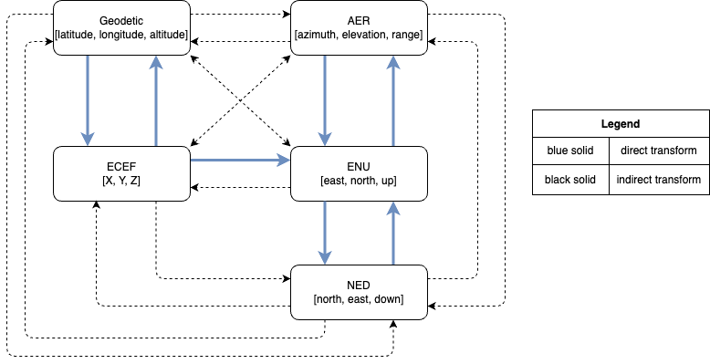

# Coordinate Transformation Toolbox

## Software requirements

- MATLAB > R2019a

> Some machines may not be able to display UTF-8 characters due to backward configuration. Please use an advanced editor to open and view the original file.

## Design Principle

This toolbox is designed based on the MATLAB's `Mapping` toolbox, and reduces the learning cost for users and the testing cost for developers by ensuring high similarity and readability with the official API.

Its main design principles are as follows

- Function name adopt name pattern in the `Mapping` toolbox, while
  - add prefix `c` to the coordiate transformation function
  - add prefix `u` to the unit conversion function
  - add prefix `cov_` to the covariance function
  - add prefix `err_` to the error function
  - add prefix `get_` to the calculation function
- Input includes parameter type verification
- Output dimension flexibility
- Only use MATLAB builtin functions
- Reference ellipsoid model is written in object-oriented form to facilitate subsequent expansion
- Encoding only uses UTF-8

> Dotted line in the schematic diagram indicates indirect transformation, which may cause cumulative errors

## Test Method

Function testing uses a combination of the following two methods

- Comparison with actual data (comparison accuracy)
- Comparison with MATLAB Mapping toolbox results (comparison precision)

Specific operations are to open the `test.m` file with MALTAB, click `Editor` -> click `Run`

After testing, the accuracy of the transformation functions in the current toolbox is > 96%

## Function List

In the toolbox, the meaning of function parameters is as follows

|      Variable      |          |             Meaning              |               Unit               |
| :----------------: | :------: | :------------------------------: | :------------------------------: |
|      X, Y, Z       | required |    target's ECEF coordinates     |                                  |
| xEast, yNorth, zUp | required |    target's  ENU coordinates     |             m, m, m              |
|   lat, lon, alt    | required |  target's geodetic coordinates   |           deg, deg, m            |
|  lat0, lon0, alt0  | required | reference's geodetic coordinates |           deg, deg, m            |
|  az, elev, rslant  | required |  target's spherical coordinates  |          azdeg, deg, m           |
|      spheroid      | optional |    reference ellipsoid model     |   'wgs84' (default) or 'grs80'   |
|     angleUnit      | optional |        input's angle unit        | 'degrees' (default) or 'radians' |
|    angleUnitOut    | optional |       output's angle unit        | 'degrees' (default) or 'radians' |

In the toolbox, the function calling syntax is as follows

- No reference point position information required
  - ECEF to Geodetic
    - `[lat, lon, alt] = cecef2geodetic(X, Y, Z, angleUnitOut)`
  - Geodetic to ECEF
    - `[X, Y, Z] = cgeodetic2ecef(lat, lon, alt, angleUnit)`
  - ENU to AER
    - `[az, elev, rslant] = cenu2aer(xEast, yNorth, zUp, angleUnitOut)`
  - AER to ENU
    - `[xEast, yNorth, zUp] = caer2enu(az, elev, rslant, angleUnit)`
- Reference point position information required
  - ECEF to ENU
    - `[xEast, yNorth, zUp] = cecef2enu(X, Y, Z, lat0, lon0, alt0, spheroid, angleUnit)`
  - ENU to ECEF
    - `[X, Y, Z] = cenu2ecef(xEast, yNorth, zUp, lat0, lon0, alt0, spheroid, angleUnit)`
  - ENU to Geodetic
    - `[lat, lon, alt] = cenu2geodetic(xEast, yNorth, zUp, lat0, lon0, alt0, spheroid, angleUnitOut)`
  - Geodetic to ENU
    - `[xEast, yNorth, zUp] = cgeodetic2enu(lat, lon, alt, lat0, lon0, alt0, spheroid, angleUnit)`
  - AER to Geodetic
    - `[lat, lon, alt] = caer2ecef(az, elev, rslant, lat0, lon0, alt0, spheroid, angleUnit)`
  - Geodetic to AER
    - `[az, elev, rslant] = cgeodetic2aer(lat, lon, alt, lat0, lon0, alt0, spheroid, angleUnitOut)`
  - ECEF to AER
    - `[az, elev, rslant] = cecef2aer(X, Y, Z, lat0, lon0, alt0, spheroid, angleUnitOut)`
  - AER to ECEF
    - `[X, Y, Z] = caer2ecef(az, elev, rslant, lat0, lon0, alt0, spheroid, angleUnit)`
